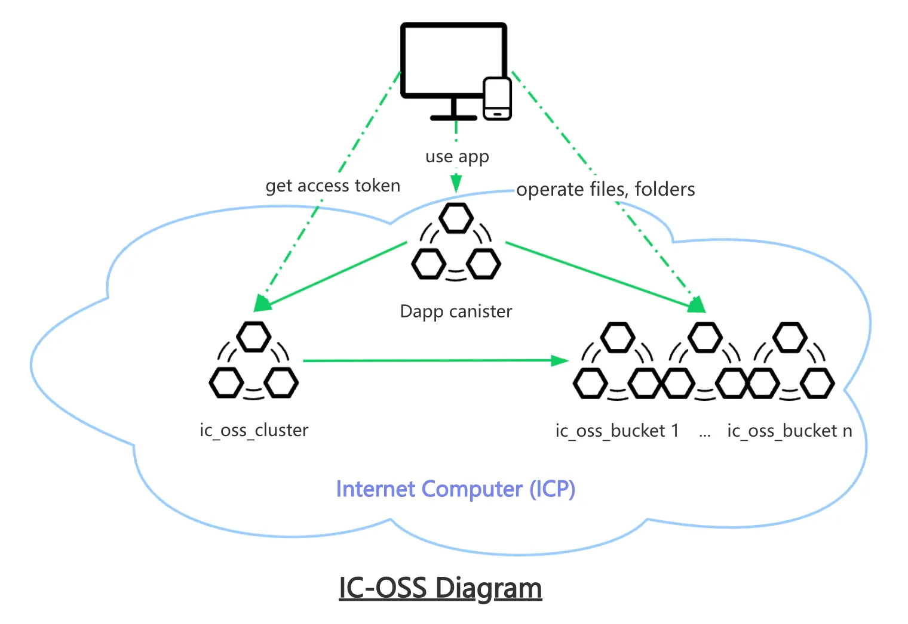
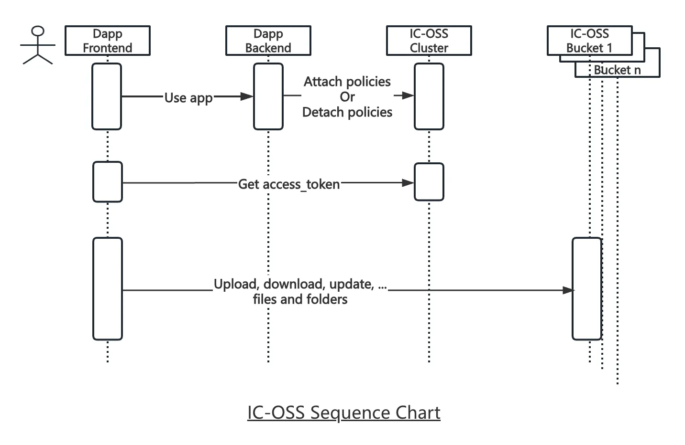

# `IC-OSS`

🗂 A decentralized Object Storage Service on the Internet Computer.

💝 Backed by a **$25k Developer Grant** from the [DFINITY Foundation](https://dfinity.org/grants).

## Overview

`ic-oss` is a decentralized object storage service fully running on the Internet Computer that provides:
- Simple and efficient file storage/retrieval
- File directory tree structure
- Unlimited horizontal scalability
- Enterprise-grade access control

Perfect for NFTs, chain blocks, verifiable credentials, blogs, documents, and decentralized applications.

## Key Features

- Large File Support
  - File sharding
  - File encryption
  - Concurrent high-speed uploads
  - Resumable uploads
  - Segmented downloads
- Advanced Organization
  - File directory tree structure
  - Bucket-based clustering
- Flexible Access Control
  - Public/private access
  - Read/write permissions
  - File/folder/bucket level controls

Check more details:
- [Bucket features](https://github.com/ldclabs/ic-oss/blob/main/src/ic_oss_bucket/README.md)
- [Cluster features](https://github.com/ldclabs/ic-oss/blob/main/src/ic_oss_cluster/README.md)
- [Access Control](https://github.com/ldclabs/ic-oss/blob/main/docs/access_control.md)

## Packages

| Package                                                                          | Description                                                  |
| :------------------------------------------------------------------------------- | :----------------------------------------------------------- |
| [ic_oss_bucket](https://github.com/ldclabs/ic-oss/tree/main/src/ic_oss_bucket)   | Storage bucket smart contract                                |
| [ic_oss_cluster](https://github.com/ldclabs/ic-oss/tree/main/src/ic_oss_cluster) | Cluster management smart contract                            |
| [ic-oss-can](https://github.com/ldclabs/ic-oss/tree/main/src/ic_oss_can)         | Rust library for implementing file storage in smart contract |
| [ic-oss-types](https://github.com/ldclabs/ic-oss/tree/main/src/ic_oss_types)     | Rust shared type definitions                                 |
| [ic-oss](https://github.com/ldclabs/ic-oss/tree/main/src/ic_oss)                 | Rust client SDK                                              |
| [ic_oss_ts](https://github.com/ldclabs/ic-oss/tree/main/src/ic_oss_ts)           | Typescript client SDK                                        |
| [ic-oss-cli](https://github.com/ldclabs/ic-oss/tree/main/src/ic_oss_cli)         | Command-line tool implemented in Rust                        |

## Who's using?

- [dMsg.net](https://dmsg.net): The world's 1st decentralized end-to-end encrypted messaging application fully running on the Internet Computer blockchain. dMsg.net uses IC-OSS to store user avatars (public), channel logos and encrypted files (private).

If you plan to use this project and have any questions, feel free to open an issue. I will address it as soon as possible.

## Integration

1. Dapp backend: Configure access control via `ic_oss_cluster`
2. Dapp frontend: Obtain `access_token` using `ic-oss-ts` SDK
3. Dapp frontend: Use token to interact with `ic_oss_bucket`

## Examples

- [examples/ai_canister](https://github.com/ldclabs/ic-oss/tree/main/examples/ai_canister): A Rust demonstration project used to show how to implement large file storage in the ICP canister by using `ic-oss-can`.
- [examples/upload_js](https://github.com/ldclabs/ic-oss/tree/main/examples/upload_js): A Javascript demonstration project used to show how to upload files to ic_oss_bucket canister by using `@ldclabs/ic_oss_ts`.
- [examples/video_player](https://github.com/ldclabs/ic-oss/tree/main/examples/video_player): A video player website to test HTTP range request.

## License
Copyright © 2024-2025 [LDC Labs](https://github.com/ldclabs).

`ldclabs/ic-oss` is licensed under the MIT License. See [LICENSE](LICENSE-MIT) for the full license text.
